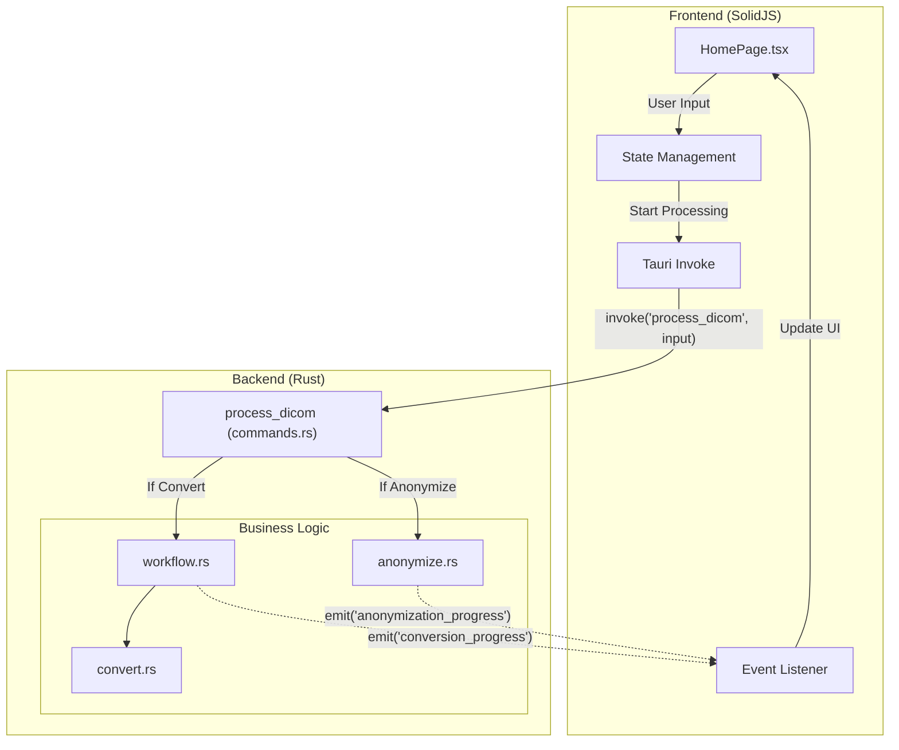

# DICOM Converter App

DICOM file processing application built with Tauri + Solid + TypeScript

## Features

- **DICOM to PNG Conversion**: Convert DICOM medical images to PNG format
- **Folder Structure Preservation**: Maintains original folder hierarchy in output
- **Batch Processing**: Process multiple DICOM files at once
- **Detailed Statistics**: Track successful/failed conversions with error details
- **Python-Compatible Output**: Output structure matches Python dicom-converter format

## Architecture

The application follows a client-server architecture using Tauri's IPC protocol to communicate between the SolidJS frontend and the Rust backend.



### Communication Protocol
- **Protocol**: Tauri IPC (Inter-Process Communication)
- **Command**: `process_dicom`
  - **Input**: `DicomProcessInput` (JSON) containing paths and configuration for conversion/anonymization.
  - **Output**: `ProcessReport` (JSON) containing success/failure statistics.
- **Events**:
  - `conversion_progress`: Real-time updates during PNG conversion.
  - `anonymization_progress`: Real-time updates during DICOM anonymization.

## Development

### If using VSCode and encountering bugs:

```bash
export GTK_PATH=""
export GIO_MODULE_DIR=""
npm run tauri dev
```

## Build

```bash
npm run tauri build
```