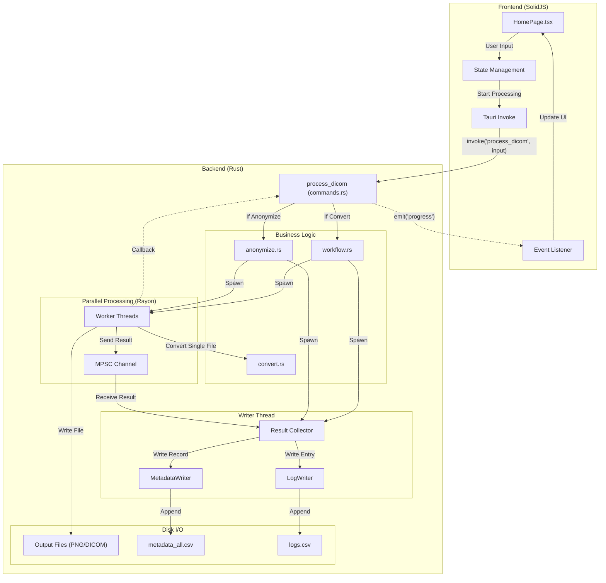

# DICOM Converter App

A high-performance DICOM processing application built with **Tauri v2**, **SolidJS**, and **Rust**.

## 🚀 Features

- **Dual Mode**: Run as a modern GUI application or a headless CLI tool.
- **High Performance**: Utilizes multi-threaded processing (Rayon) for fast conversion and anonymization.
- **Incremental Saving**: Writes metadata and logs to disk immediately as files are processed, preventing data loss.
- **DICOM to PNG**: High-quality conversion preserving 16-bit depth information where applicable.
- **Anonymization**: robust de-identification of sensitive patient data with customizable tag replacement.
- **Smart Skipping**: Automatically skips already processed files to resume interrupted jobs efficiently.
- **Detailed Reporting**: Generates comprehensive CSV reports (`metadata_all.csv`, `logs.csv`) and JSON summaries.

## 🏗️ Architecture

The application follows a client-server architecture using Tauri's IPC protocol.



## 🛠️ Development

### Running Locally

```bash
# Install frontend dependencies
npm install

# Run in development mode (GUI)
npm run tauri dev

# Run CLI in development mode
cargo run -- --help
```