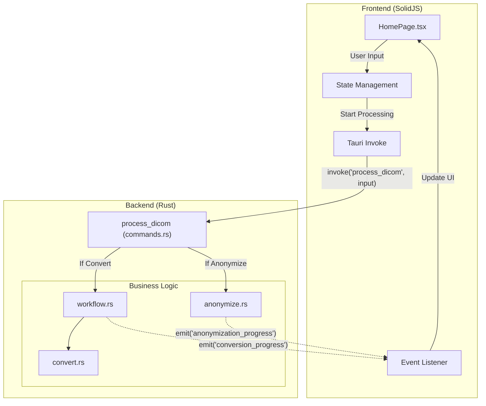

# DICOM Converter App

DICOM file processing application built with Tauri + Solid + TypeScript

## Features

- **DICOM to PNG Conversion**: Convert DICOM medical images to PNG format
- **Folder Structure Preservation**: Maintains original folder hierarchy in output
- **Batch Processing**: Process multiple DICOM files at once
- **Detailed Statistics**: Track successful/failed conversions with error details
- **Python-Compatible Output**: Output structure matches Python dicom-converter format

## Architecture

The application follows a client-server architecture using Tauri's IPC protocol to communicate between the SolidJS frontend and the Rust backend.



### Communication Protocol
- **Protocol**: Tauri IPC (Inter-Process Communication)
- **Command**: `process_dicom`
  - **Input**: `DicomProcessInput` (JSON) containing paths and configuration for conversion/anonymization.
  - **Output**: `ProcessReport` (JSON) containing success/failure statistics.
- **Events**:
  - `conversion_progress`: Real-time updates during PNG conversion.
  - `anonymization_progress`: Real-time updates during DICOM anonymization.

## Development

### If using VSCode and encountering bugs:

```bash
export GTK_PATH=""
export GIO_MODULE_DIR=""
npm run tauri dev
```

## Build

```bash
npm run tauri build
```

## CLI Usage

The application also supports a Command Line Interface (CLI) for automation and headless operation.

### Running CLI

You can run the CLI using the built binary or via `cargo run` during development.

#### Convert DICOM to PNG
```bash
# Development
cargo run -- convert --input <INPUT_FOLDER> --output <OUTPUT_FOLDER> [--skip-excel] [--flatten-output]

# Production Binary
./dicom-app convert --input <INPUT_FOLDER> --output <OUTPUT_FOLDER>
```

**Note on `--flatten-output`:**

By default, the converter creates a subfolder named `<INPUT_FOLDER_NAME>_output` inside your specified output directory.
Using `--flatten-output` removes this extra nesting level.

**Default behavior:**
```
output_folder/
  └── dicom_input_output/
      ├── png_file/
      │   ├── image1.png
      │   └── ...
      └── metadata.xlsx
```

**With `--flatten-output`:**
```
output_folder/
  ├── png_file/
  │   ├── image1.png
  │   └── ...
  └── metadata.xlsx
```

#### Anonymize DICOM
```bash
# Development
cargo run -- anonymize --input <INPUT_FOLDER> --output <OUTPUT_FOLDER> --tags "0010,0010" --tags "0010,0020" --replacement "ANONYMIZED"

# Production Binary
./dicom-app anonymize --input <INPUT_FOLDER> --output <OUTPUT_FOLDER> --tags "0010,0010" --replacement "xxx"
```

### Help
To see all available commands and options:
```bash
./dicom-app --help
```